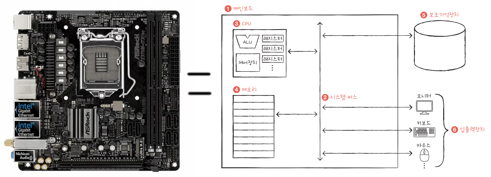
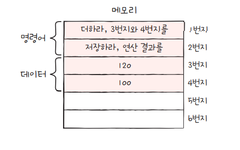
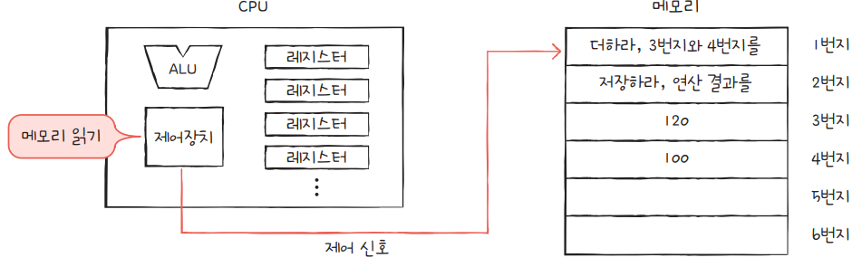
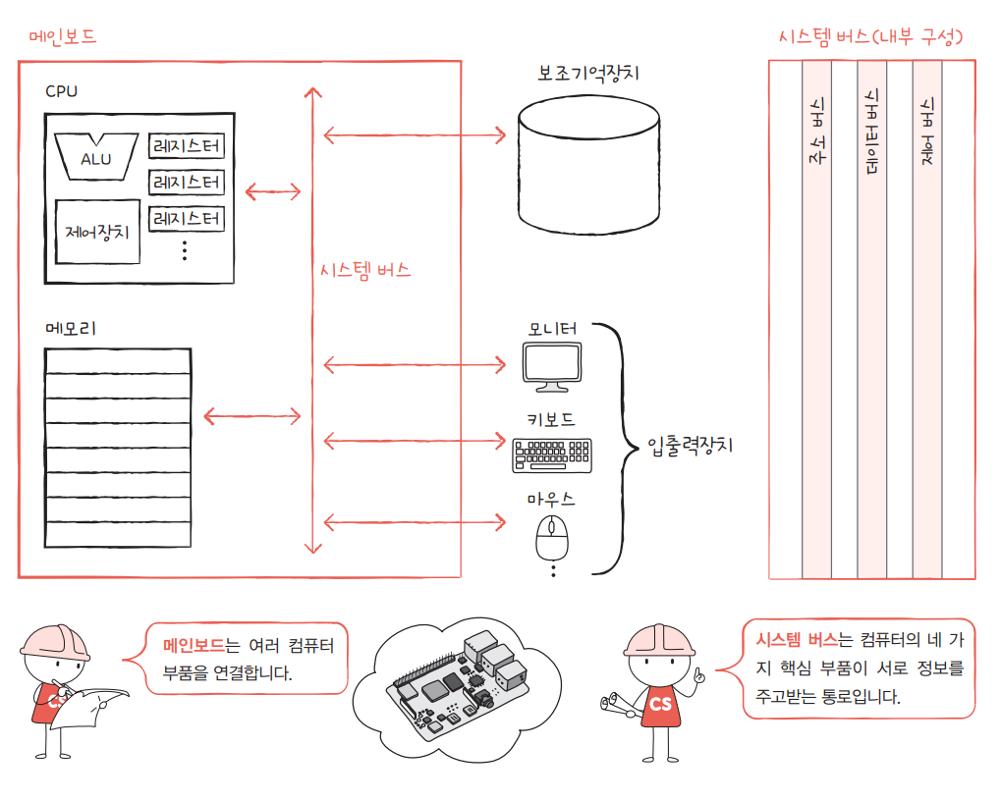

# 01-2. 컴퓨터 구조의 큰 그림

### 학습목표

- 컴퓨터가 이해하는 정보를 이해한다.
- 컴퓨터의 네 가지 핵심 부품에 대해 이해한다.
  - CPU
  - 메모리(=주기억장치)
  - 보조기억장치
  - 입출력장치

### 1. 데이터와 명령어

```python
print("hello world")
# -> "hello world"라는 데이터를 출력하라는 명령어

1 + 2
# -> 1과 2라는 데이터를 더하라는 명령어
```

- 데이터
  
  - 숫자, 문자, 이미지, 동영상과 같은 정적인 정보를 데이터라고 한다.
  - 데이터는 0과 1로 표현할 수 있다 (→ 2장)

- 명령어
  
  - ***컴퓨터는 명령어를 처리하는 기계***
  - 명령어는 데이터를 움직이고 컴퓨터를 작동시킨다.
  - 마찬가지로 0과 1로 표현되는 정보이다. (→ 3장)

### 2. 컴퓨터의 핵심 부품



컴퓨터의 메인보드를 구성하는 핵심 부품들. 시스템 버스를 통해 서로 신호를 주고받는다.

- 메모리
- CPU
- 보조기억장치
- 입출력장치


### 2-1. 메모리(※ 주기억장치)



- 주기억장치는 RAM/ROM이 있으나 이 책에서는 RAM(메모리)만 다루기로 한다.

- 메모리는 **현재** 실행되는 프로그램의 명령어와 데이터를 저장한다.
  
    → 이외에는 보조기억장치에 저장된다.

- 메모리는 주소 개념을 통해 원하는 명령어/데이터가 어디에 저장되어 있는지 알 수 있다.


### 2-2. CPU



- 메모리에 저장된 명령어를 읽고 해석, 실행하는 부품이다.
- CPU는 다음 3가지 부품을 토대로 구성되어 있다.
  - ALU : 계산기
  - 레지스터 : CPU 내부의 작은 저장장치
  - 제어장치 : 제어 신호를 내보내고, 명령어를 해석하는 장치


### 2-3. 보조기억장치

- 전원이 꺼져도 보관될 프로그램을 저장한다.

- 가격이 비싸고 휘발성인 메모리를 보완해주는 역할을 한다.
  
    ex) 하드디스크, SSD, USB, DVD


### 2-4. 입출력장치

- 컴퓨터 외부에 연결되어 컴퓨터 내부와 정보를 교환할 수 있는 부품이다.

- 완전히 분리된 개념이 아니라, 보조기억장치도 입출력장치의 일부로 볼 수 있다.
  
    ex) 모니터, 마우스, 키보드

