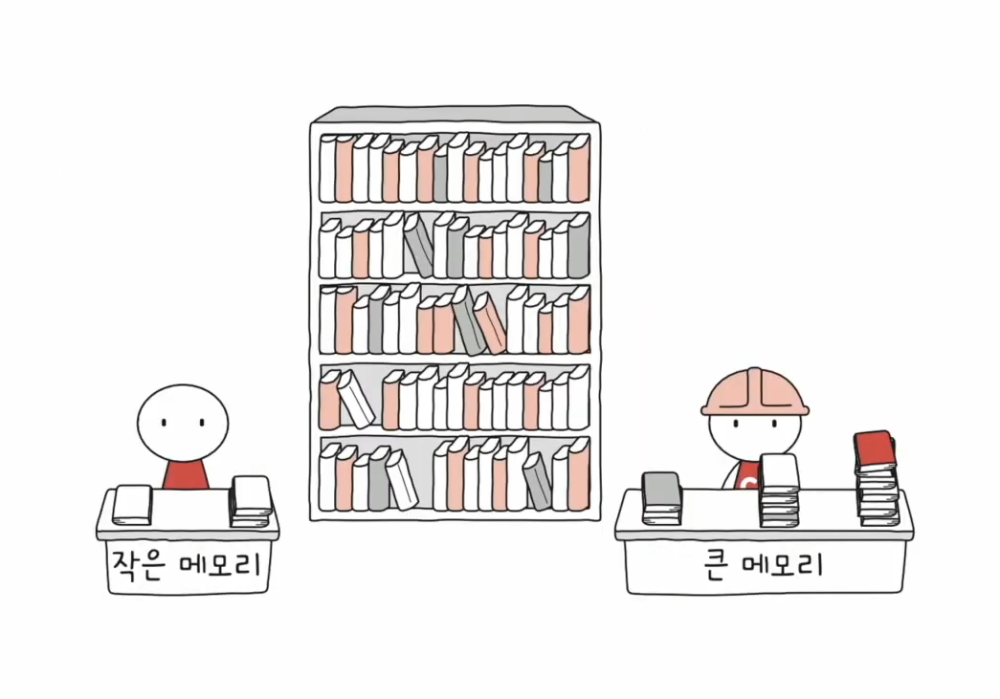
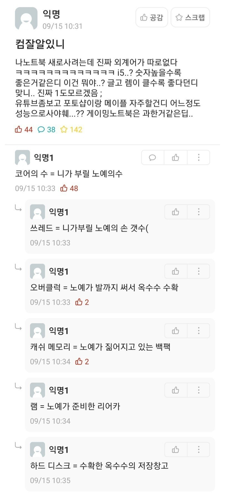
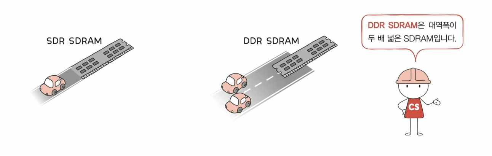
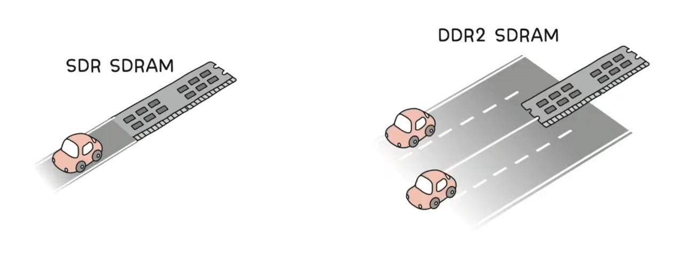

# RAM의 특징과 종류

## RAM (Random Access Memory)의 특징

- 휘발성 저장 장치

- 비휘발성 저장 장치 - 하드 디스크, SSD, CD-ROM, USB

## RAM의 용량과 성능

RAM `책상` 의 용량은 보조기억장치 `책장` 의 프로그램 가져오는 시간을 절약해준다

## RAM의 종류

- DRAM (Dynamic RAM)
  
  - 시간이 지나면 데이터가 소멸하여 재활성화가 필요
  
  - 소비 전력이 비교적 낮고 설계가 용이

- SRAM (Static RAM)
  
  - 데이터가 소실되지 않음 (물론 휘발성 메모리)
  
  - DRAM보다 일반적으로 빠름
  
  - 소비 전력이 높고 가격도 비쌈 (캐시메모리에 사용 in 06-3)

- SDRAM (Synchronous Dynamic RAM)
  
  - 클럭 신호와 동기환된 RAM
  
  - 일반적으로 SDR (Single Data Rate)을 의미함

- DDR SDRAM (Double Data Rate SDRAM)
  
  - 가장 대중적인 RAM (DDR4 - 16배의 대역폭)
  
  - 대역폭을 넓혀 속도를 빠르게 만든 SDRAM

