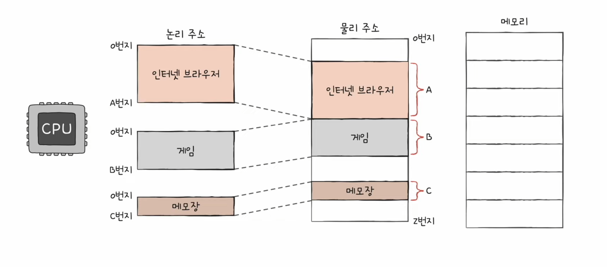
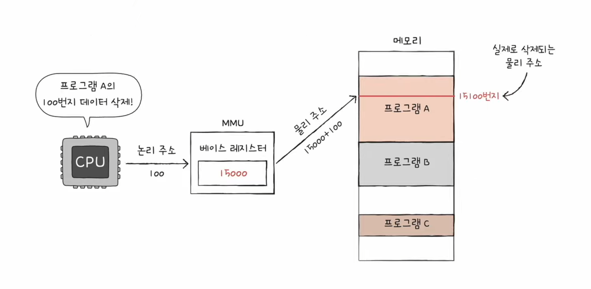
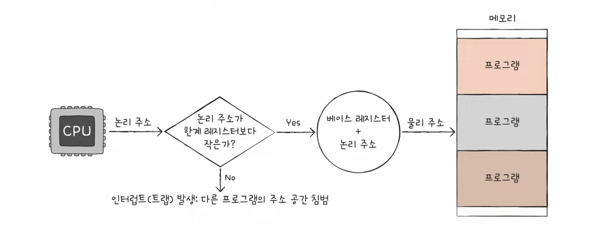

# 메모리의 주소 공간

## 물리 주소와 논리 주소

- 물리 주소 - 정보가 실제로 저장된 하드웨어 상의 주소

- 논리 주소 - 실행 중인 프로그램 각각에게 부여된 0번지부터 시작되는 주소

#### 메모리 관리 장치 (MMU; Memory Management Unit)

- 논리 주소를 물리 주소로 변환을 담당

- CPU와 주소 버스 사이에 위치

- CPU의 논리 주소 + 베이스 레지스터의 값 (베이스 레지스터 주소 지정 방식)
  
  - 베이스 레지스터 - 프로그램의 **기준 주소**
  
  - 논리 주소 - 기준 주소로부터 떨어진 거리, 오퍼랜드로부터 온 수정 값

## 메모리 보호 기법

#### 한계 레지스터

- 프로그램 영역을 벗어나는 명령어의 실행을 인터럽트

- 베이스 레지스터 값 <= 프로그램의 물리 주소 범위 < 베이스 레지스터 + 한계 레지스터

