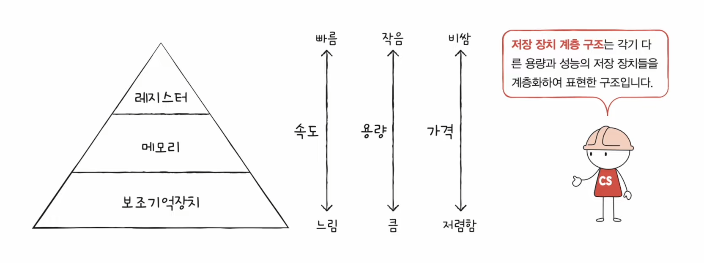
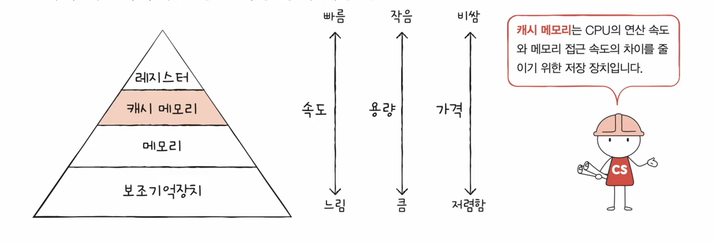
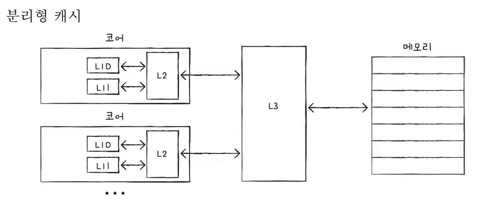

# 캐시 메모리

## 저장 장치 계층 구조 (memory hierarchy)

효율성을 위하여 CPU를 기준으로 세운 컴퓨터 저장 장치들의 계층

## 캐시 메모리

- 연산 속도와 메모리 접근 속도의 차이를 줄이기 위한 메모리

- 레지스터보다 용량이 크고 메모리보다 빠른 SRAM 기반 저장 장치

- CPU와 메모리 사이에 위치

- 캐시 메모리 간에도 CPU와 가까운 순서로 L1, L2, L3 캐시의 계층이 존재

#### 분리형 캐시

- 코어마다 존재하는 L1 캐시는 L1I와 L1D로 분리하여 분리형 캐시로 사용하기도함

- 코어 간의 싱크 조절이 중요

## 참조 지역성의 원리

1. 보조기억장치 - 전원이 꺼져도 기억할 대상

2. 메모리 - 실행 중인 대상

3. 캐시 메모리 - CPU가 사용할 법한 대상
   
   - 해당 예측이 맞는 경우를 **캐시 히트**
   
   - 예측이 틀려 데이터를 가져와야하는 경우 **캐시 미스**
   
   - **캐시 적중률** = 캐시 히트 / (캐시 히트 + 캐시 미스)
     
     - 일반적으로 컴퓨터의 캐시 적중률은 85~95%

#### 1. CPU는 최근에 접근했던 메모리 공간에 다시 접근하려는 경향이 있다.

- **시간 지역성**의 특성을 가진다라고 표현할 수 있다.

- 프로그래밍 언어에서 변수와 같이 다시 참조될 메모리가 해당 경향이 높다고 본다.

#### 2. CPU는 접근한 메모리 공간 근처를 접근하려는 경향이 있다.

- 이러한 경향을 **공간 지역성**이라고 표현한다.

- CPU가 실행하는 프로그램은 일반적으로 한 물리 주소에 모여 있다.
