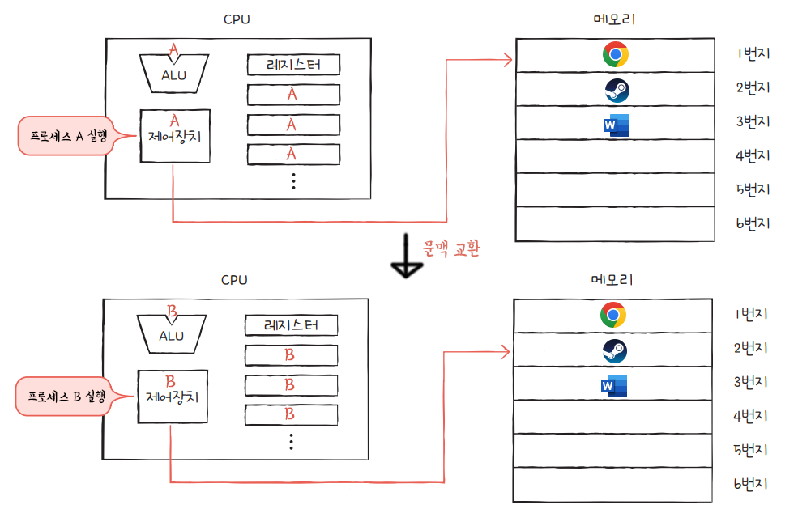

# 10-1. 프로세스 개요

### 학습목표

- 프로세스의 개념을 이해한다.
- 메모리의 커널 영역과 사용자 영역의 작동 원리를 이해한다.

### 프로세스란?

- 프로세스 생성 과정
  - 보조기억장치에서 프로그램을 메모리에 적재하는 순간 프로세스가 된다.

### 프로세스 분류

- 포그라운드 프로세스
- 백그라운드 프로세스
  - 사용자와 직접 상호작용 가능한 백그라운드 프로세스
  - 사용자와 상호작용 없이 정해진 일을 수행하는 백그라운드 프로세스
    - 윈도우 - 서비스
    - 유닉스 - 데몬

### 메모리 - 커널 영역

- PCB(프로세스 제어 블록)
  - CPU는 한 번에 여러 프로그램을 처리하지 않기 때문에 PCB에 정보를 저장한다.
  - PCB에 기존 프로세스의 정보를 저장하고, 새로운 프로세스의 PCB를 받아 실행한다.
  - 이 과정을 문맥 교환이라고 한다.
  - PCB에 담겨 있는 대표적인 정보는 다음과 같다.
    - 프로세스 ID(PID)
    - 레지스터 값
    - 프로세스 상태
    - CPU 스케줄링 정보
    - 메모리 관리 정보
    - 사용한 파일과 입출력장치 목록

### 메모리 - 사용자 영역

- 정적 할당 영역
  - 코드 영역
  - 데이터 영역
- 동적 할당 영역
  - 힙 영역
  - 스택 영역