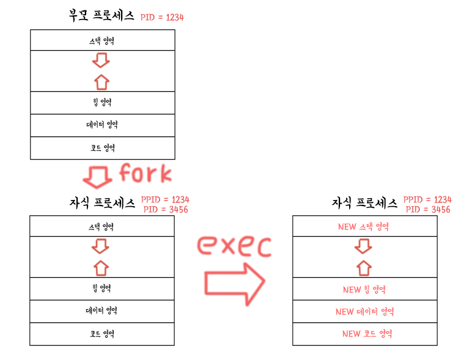

# 10-2. 프로세스 상태와 계층 구조

### 학습목표

- 프로세스의 상태와 계층 구조를 이해한다.

### 프로세스의 상태

- 생성
  - 막 메모리에 적재되어 PCB를 할당받은 상태
- 준비
  - CPU를 할당받을 차례를 기다리는 상태
- 실행
  - CPU를 할당받아 실행 중인 상태
- 대기
  - 입출력 작업은 CPU에 비해 속도가 느리기 때문에 작업이 끝날 때까지 기다리는 상태
- 종료
  - 프로세스가 종료된 상태

### 프로세스의 계층 구조

프로세스는 실행 도중 시스템 호출을 통해 다른 프로세스를 생성할 수 있다.

생성된 자식 프로세스들은 부모 프로세스의 PID 정보를 기록한다.

### 프로세스 생성 기법

- fork
  - 부모 프로세스 기반의 새로운 프로세스를 생성한다.
  - 메모리 할당이 이루어진다.
- exec
  - 프로세스를 exec 함수가 호출한 내용으로 덮어씌운다.
  - 기존 프로세스의 PID는 유지한다.

프로세스 다루기 실습

[https://github.com/kangtegong/self-learning-cs/blob/main/process/process_python.md#python으로-프로세스-다루기](https://github.com/kangtegong/self-learning-cs/blob/main/process/process_python.md#python%EC%9C%BC%EB%A1%9C-%ED%94%84%EB%A1%9C%EC%84%B8%EC%8A%A4-%EB%8B%A4%EB%A3%A8%EA%B8%B0)