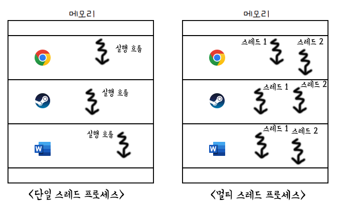
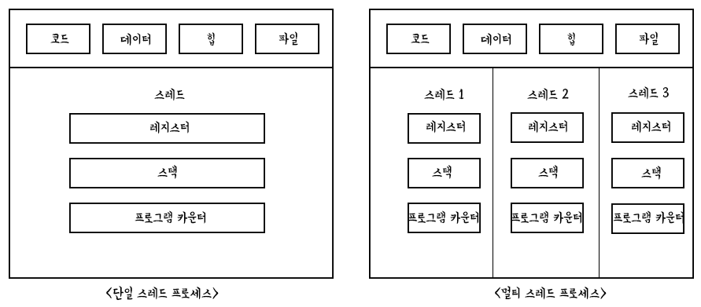
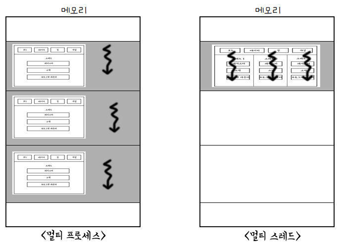

# 10-3. 스레드

### 학습목표

- 스레드의 개념을 이해한다.
- 멀티프로세스와 멀티스레드의 개념을 이해한다.

### 스레드

- 프로세스를 구성하는 실행 단위
  - 단일 스레드 프로세스
  - 멀티스레드 프로세스

- 스레드끼리는 프로세스 내의 자원을 공유한다.
  - 독자적으로 갖는 값 : 스레드 ID, 레지스터 값(프로그램 카운터), 스택
  - 공유하는 값 : 코드, 데이터, 힙, 파일

### 멀티프로세스와 멀티스레드

- 멀티프로세스
  - 프로세스를 fork하여 같은 작업을 하는 동일한 프로세스를 생성한다.
  - 코드/데이터/힙 영역을 비롯한 모든 자원이 복제되어 메모리에 적재된다.
- 멀티스레드
  - 스레드의 일부 자원을 제외하고 프로세스의 자원을 공유하여 **협력과 통신에 유리**하다.
  - 멀티프로세스에 비해 **메모리를 효율적으로 사용**할 수 있다.
  - 하지만 하나의 **스레드에 문제가 생기면 프로세스 전체에 문제**가 생길 수 있다.

스레드 다루기 실습

[https://github.com/kangtegong/self-learning-cs/blob/main/thread/thread_python.md#python으로-스레드-다루기](https://github.com/kangtegong/self-learning-cs/blob/main/thread/thread_python.md#python%EC%9C%BC%EB%A1%9C-%EC%8A%A4%EB%A0%88%EB%93%9C-%EB%8B%A4%EB%A3%A8%EA%B8%B0)