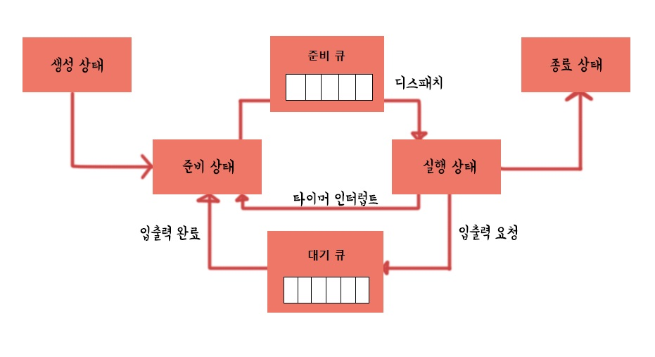

# CPU 스케줄링 개요

CPU 스케줄링 : 운영체제가 프로세스들에게 공정하고 합리적으로 CPU 자원을 배분하는 것

### 프로세스 우선순위

일반적으로 프로세스는 CPU와 입출력 장치 사이에서 실행 상태와 대기 상태가 반복

- 입출력 집중 프로세스 <-> 입출력 버스트

- CPU 집중 프로세스  <-> CPU 버스트 

##### 프로세스의 PCB에 우선순위를 부여 및 기록

## 스케줄링 큐

그러나 항상 모든 프로세스의 우선순위를 확인하고 비교하는 것은 비효율적

- 특정 목적을 가진 프로세스들을 구분하여 줄을 세우는 것이 스케줄링 큐
  
  - CPU를 사용
  
  - 메모리 적재
  
  - 특정 입출력장치 사용

- 준비 큐와 대기 큐로 나누어 운영체제가 프로세스를 관리
  
  - 준비 큐에서 CPU의 사용 차례를 기다림
  
  - 같은 장치를 요구한 프로세스들은 대기 큐에서 기다림

## 선점형과 비선점형 스케줄링

- 선점형 스케줄링 (preemptive scheduling)
  
  - 한 프로세스가 CPU를 사용하고 있더라도 운영체제에 의해 자원을 뺏앗아 다른 프로세스에 할당할 수 있는 스케줄링 방식
  
  - 대부분의 운영체제가 채용하는 일반적인 방식

- 비선점형 스케줄링 (non-preemptive scheduling)
  
  - 한 프로세스가 자원을 사용하면 해당 프로세스가 종료되거나 스스로 대기 상태에 접어들기 전까지 다른 프로세스가 끼어들 수 없는 스케줄링
  
  - 프로세스 전환이 힘들거나 실행 시간에 대한 예측이 필요한 경우 사용됨
