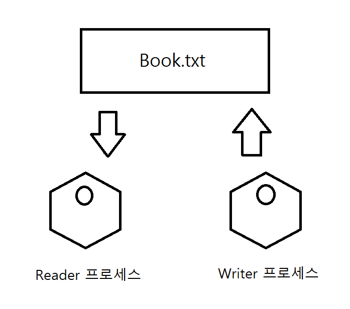
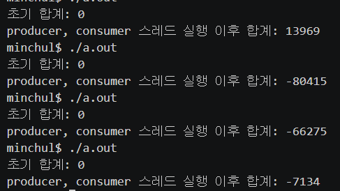

# Chapter12_1 동기화란
학습목표 : 운영체제의 프로세스 관리 서비스 중 가장 중요한 스케줄링과 동기화 중 동기화에 대해 학습

# 프로세스 동기화
- 프로세스들 사이의 수행시기를 맞추는 것
    - 실행 순서 제어 : 프로세스를 올바른 순서대로 실행
    - 상호 배제 : 동시에 접근해서는 안 되는 자원에 하나의 프로세스만 접근하게 함
- 동기화는 프로세스뿐만 아니라 실행의 흐름을 갖는 모든 것이 동기화의 대상

## 동기화의 종류 
- 실행 순서 제어를 위한 동기화
- 상호 배제를 위한 동기화

### 1. 실행 순서 제어를 위한 동기화

- 프로세스는 아무 순서대로 수행되면 안 된다.
- Reader와 Writer 프로세스가 존재한다고 가정할 때, Reader 프로세스는 Book.txt에 아무것도 없으면 실행되지 않는다. 따라서 Writer 프로세스 -> Reader 프로세스 순으로 실행되어야 한다.
- 이런 순서를 제어하는 과정을 실행 순서 제어를 위한 동기화라고 함.
<center></center>

### 2. 상호 배제를 위한 동기화
- **상호 배제** : 공유가 불가능한 자원의 동시 사용을 피하기 위해 사용하는 알고리즘
  
- 동기화가 이루어지지 않은 경우
    - 동기화가 이루어지지 않은 경우 A가 끝나기도 전에 B가 잔액을 읽었기에 제대로된 결과가 나오지 않는다.
    ```python
    '''
    상호 배제를 위한 동기화 ex
    계좌에는 10만원 저축
    프로세스 A : 저축된 금액에 2만원 넣는 process
    프로세스 B : 저축된 금액에 5만원 넣는 process
    '''
    # 동기화가 제대로 이루어지지 않은 경우
    money = 10
    processA = 2
    processB = 5
    # process A와 process B가 동시에 실행되었다고 하면
    # 1. process A,B에서 잔액을 읽는다.
    moneyA = money     # 10
    moneyB = money     # 10
    # 2. 읽어들인 값에서 2만원 더한다.
    moneyA += processA      # 12
    # 2. 읽어들인 값에서 5만원 더한다.
    moneyB += processB      # 15
    money = moneyA # money 는 moneyA가 된다.       # 12
    money = moneyB       # 15
    ```
- 동기화가 이루어진 경우
    - 동기화가 이루어지게 되면 동시에 접근하면 안 되는 자원을 동시에 접근하지 않게 해준다. 따라서 제대로된 결과를 얻을 수 있다.
    ```python
    # 동기화가 이루어진 경우
    money = 10
    processA = 2
    processB = 5
    # process A와 process B가 동시에 실행되었다고 하면
    # 1. process A에서 먼저 잔액을 읽는다.
    moneyA = money      # 10
    # 2. 읽어들인 값에서 2만원 더한다.
    moneyA += processA     # 12
    # 3. money에 더한 값을 저장한다.
    money = moneyA      # 12
    # 4. processB에서 잔액을 읽는다.
    moneyB = money      # 12
    # 5. 읽어들인 값에서 5만원 더한다.
    moneyB += processB       # 15
    # 6. money에 값을 업데이트한다.
    money = moneyB       # 17
    ```

# 생산자와 소비자 문제
- 생산자 : 물건을 계속 생산하는 프로세스, 버퍼에 물건을 넣은 후 물건의 총합에 해당하는 변수 1 증가
- 소비자 : 물건을 계속 소비하는 프로세스, 버퍼에 물건을 뺀 후 물건의 총합에 해당하는 변수 1 감소
- 총합 : 생산자와 소비자가 공유하는 데이터
<center></center>

- 해당 문제는 생산자 프로세스와 소비자 프로세스가 제대로 동기화되지 않음으로 발생함
- 소비자가 생산자의 작업이 끝나기 전에 총합 수정 -> 생산자 또한 소비자가 작업이 끝나기 전에 수정 
- 동시에 접근해서는 안 되는 자원에 동시에 접근해서 문제가 일어남


# 공유 자원과 임계 구역
## 공유자원, 임계구역
- 앞서 상호배제의 잔액과, 생산자소비자문제의 총합은 공동의 자원이었음
- 이렇게 작업을 하며 존재하는 공동의 자원을 **공유자원**이라 함
- 해당 공유자원에 두 개 이상의 프로세스를 동시에 실행하면 문제가 발생
- 문제가 발생되는 코드 영역을 **임계구역**이라고 함
- 임계 구역에 먼저 진입한 프로세스가 있다면 다른 프로세스는 대기해야 함.


### 레이스 컨디션 
- 임계 구역에서 잘못된 실행으로 여러 프로세스가 동시에 실행되어 문제가 발생하는 것

- 레이스 컨디션의 예시
    - 동기화가 제대로 이루어지지 않은 상호배제 예시

    ```python
    # 동기화가 제대로 이루어지지 않은 경우
    money = 10
    processA = 2
    processB = 5
    # process A와 process B가 동시에 실행되었다고 하면
    # 1. process A,B에서 잔액을 읽는다.
    moneyA = money     # 10
    moneyB = money     # 10
    # 2. 읽어들인 값에서 2만원 더한다.
    moneyA += processA      # 12
    # 2. 읽어들인 값에서 5만원 더한다.
    moneyB += processB      # 15
    money = moneyA # money 는 moneyA가 된다.       # 12
    money = moneyB       # 15
    ```
- 따라서 상호배제를 위한 동기화는 세 가지 원칙을 따라야 함.
    - 상호 배제
        - 한 프로세스가 임계 구역에 들어갈 시, 다른 프로세스 진입 불가
    - 진행
        - 임계 구역에 어떤 프로세스도 없다면 진입하고자 하는 프로세스 진입 가능
    - 유한 대기
        - 이미 임계구역에 프로세스가 존재하면 다른 프로세스는 대기하여 언젠가는 들어갈 수 있음
    
**위 원칙을 토대로 상호배제를 위한 동기화의 원리 및 실행순서제어를 위한 동기화에 대해 12-2에서 알아볼 것**