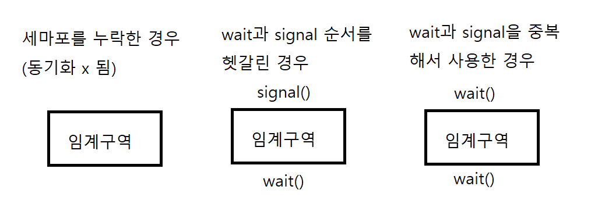
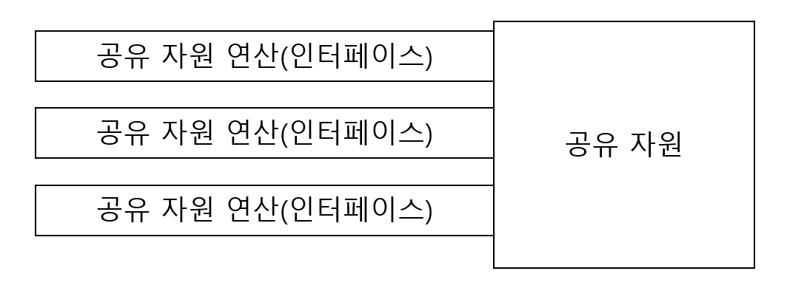
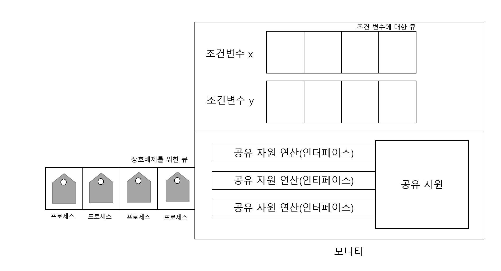
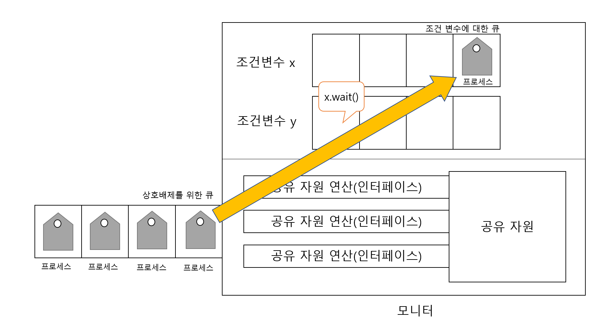
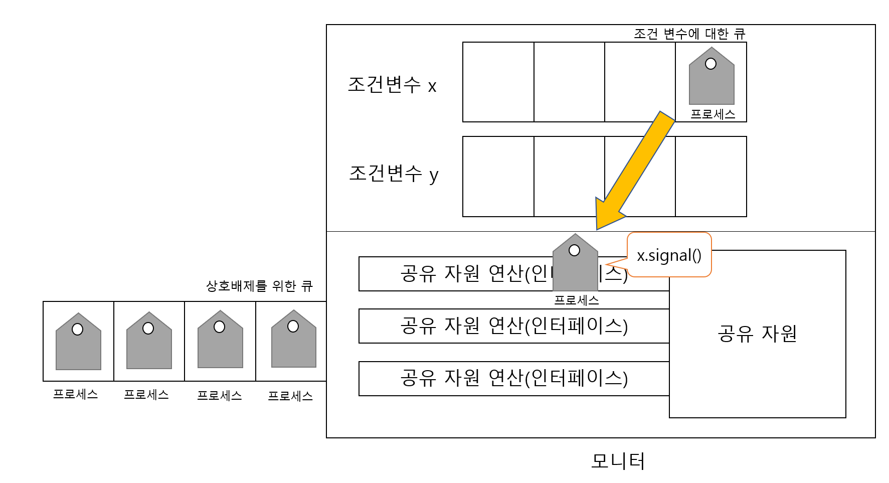

# Chapter12_2 동기화 기법
학습목표 : 동기화를 위한 대표적 도구인 뮤택스 락, 세마포, 모니터에 대해 알아보기

# 뮤텍스 락 
- 동시에 접근해서는 안 되는 자원에 동시에 접근하지 않도록 만드는 도구
- 상호배제를 위한 동기화 도구
```python
from threading import Thread, Lock
import threading
'''
탈의실 예시
탈의실은 자물쇠가 걸려있으면 사용자가 있는 것을 인식하고 대기한다.
이러한 자물쇠 기능을 코드로 구현한 것이 뮤텍스 락
'''
# mutex를 사용할 때
def worker(mutex, data, thread_safe):
    if thread_safe:
        mutex.acquire() # 임계 구역 잠그는 역할
        # 만약 임계 구역이 잠겨있다면
        # 임계 구역이 잠겨있는지 반복적으로 확인
        # 임계 구역이 잠겨있지 않다면 임계 구역 잠금
    try:
        print('손님 {} : {}번째입장\n'.format(threading.get_ident(), data))
    finally:
        if thread_safe:
            mutex.release() # 임계 구역 잠금 해제
            # 임계 구역 작업이 끝나면 잠금 해제

if __name__ == '__main__':
    threads = []
    thread_safe = True
    mutex = Lock()
    for i in range(20):
        t = Thread(target=worker, args=(mutex, i, thread_safe))
        t.start()
        threads.append(t)
    for t in threads:
        t.join()
```
- 진입하는 사용자는 임계 구역에 있음을 **뮤텍스락**을 통해 자물쇠를 걸어둠
- 다른 프로세스는 임계구역이 잠겨있다면 기다리고 아니라면 진입함
  - 자물쇠 역할 : 전역변수 lock
  - 임계 구역을 잠그는 역할 : acquire 함수
  - 임계 구역의 잠금 해제 : release
- acquire 함수를 이용해 탈의실에 문이 잠겨있는지 계속 확인해주는 작업이므로 바쁘게 움직인다하여 **바쁜대기**라고 함

# 세마포
- 뮤텍스 락과 비슷
- 공유자원이 여러 개 있는 상황에서 적용 가능한 동기화 도구
- ex) 옷가게에서 탈의실이 여러개일 때, 여러 사람이 동시에 이용하도록 해주는 프로세스

## 세마포의 구현
- 전역 변수 S : 임계 구역에 진입할 수 있는 프로세스의 개수
- wait 함수 : 임계 구역에 들어가도 좋은지 알려주는 함수
- signal 함수 : 임계 구역 앞에서 기다리는 프로세스에게 실행해도 좋다고 신호를 주는 함수

```python
import threading
import time


class ThreadPool(object):
    def __init__(self):
        self.active = []
        self.lock = threading.Lock()

    def acquire(self, name):    
        with self.lock:
            self.active.append(name)  
            print('탈의실 입장: {} | 현 탈의실 인원 {}'.format(name, self.active))
    def release(self, name):    # signal 함수 호출
        with self.lock:
            self.active.remove(name)
            print('탈의실 퇴장: {} | 현 탈의실 인원 {}'.format(name, self.active))

def worker(semaphore, pool):
    with semaphore:
        name = threading.currentThread().getName()
        pool.acquire(name)
        time.sleep(1)
        pool.release(name)
        
if __name__ == '__main__':
    threads = []
    pool = ThreadPool()
    semaphore = threading.Semaphore(3)
    for i in range(10):
        t = threading.Thread(
        target=worker, name='손님 '+str(i), args=(semaphore, pool))
        t.start()
        threads.append(t)
    for t in threads:
        t.join()
```

# 모니터

### 세마포의 문제점
<center></center>

- 세마포는 임계구역에 앞뒤로 확인을 해줘야 하므로 번거로움
- 만일 잘못된 코드를 짜는 경우 예기치 못한 결과를 얻게 됨.
- 해당 세마포의 문제점을 보완한 것이 모니터

### 모니터
- 모니터는 공유자원과 공유자원에 접근하기 위한 인터페이스를 묶어서 관리함
- 프로세스는 인터페이스를 통해서 공유자원에 접근하도록 함

#### 모니터의 구조
- 모니터는 공유자원과 공유자원에 접근하기 위한 인터페이스를 묶어 관리함
- 프로세스는 반드시 **인터페이스를 통해서만 공유자원에 접근**
<center></center>

- 1. 프로세스를 큐에 삽입
- 2. 큐에 삽입된 순서대로 하나씩 공유자원 이용
- 3. 상호 배제를 위한 동기화 제공

#### wait, signal 연산 수행
- 상호배제를 위한 큐 : 모니터에 진입하기 위해 삽입되는 큐
- 조건변수에 대한 큐 : 모니터에 이미 진입한 프로세스의 실행조건이 만족될 때까지 잠시 실행을 중단하기 위해 만들어진 큐
<center></center>

- 상호배제를 위한 큐에서 모니터에 진입
- x.wait()를 통해 조건변수 x에 대한 wait 호출
- 조건변수 x에 해당 프로세스 삽입
- 현재 프로세스 상태: wait 연산으로 일시 중지된 상태
<center></center>

- 다른 프로세스의 signal 연산을 통해 재개
- signal : wait을 호출하여 큐에 삽입된 프로세스 실행 재게
- x.signal()을 통해 조건변수 x에 대한 signal 호출 시, x에 대기중이던 프로세스가 모니터 안으로 들어감
- signal 호출이 되었다는 의미는 모니터 내에 프로세스가 떠났다는 의미
- 따라서 x내에 있는 프로세스는 모니터에 들어와 실행되고, 자신의 실행이 끝나면 signal 호출
<center></center>