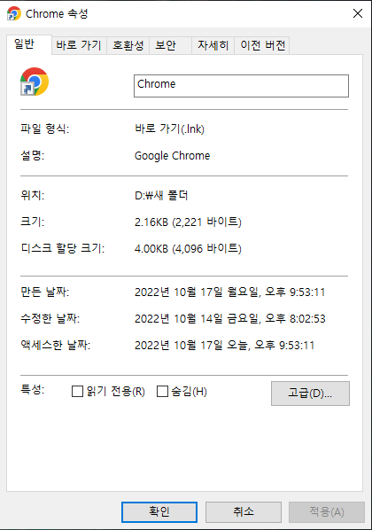
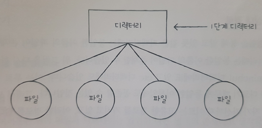
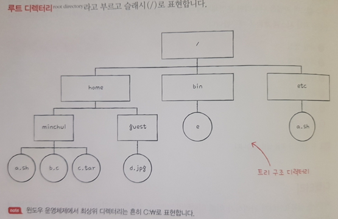

# chapter_15

## 15-1. 파일과 디렉터리

### 1. 파일

1. 정의: 하드 디스크나 SSD와 같은 보조기억장치에 저장된 관련 **정보의 집합** 

2. 정보의 집합: 파일을 실행하기 위한 정보, 파일 관련 부가 정보의 집합으로 해당 정보를   **속성**또는 **메타데이터**라고 합니다.
   
   

3. 대표적인 속성종류: 유형, 크기, 보호, 생성 날짜, 마지막 접근 날짜, 마지막 수정 날짜, 생성자, 소유자, 위치

4. 유형
   
   1. 정의: 운영체제가 인식하는 파일 종류
   
   2. 방식: 파일 이름 뒤에 붙는 **확장자**를 활용. 확장자를 통해서 운영체제에 해당 파일이 어떤 유형의 파일인지 알려준다.

5. 파일 연산을 위한 시스템 호출
   
   1. 파일을 다루는 모든 작업은 운영체제에 의해 이뤄지며 임의로 파일을 조작하려면 운영체제에 부탁해야한다.(=시스템 호출)
   
   2. 어떤 조작을 하려는가? 파일 생성, 삭제, 열기, 닫기, 읽기, 쓰기(암기x)

### 2. 디렉터리

1. 정의: 파일들을 일목요연하게 관리하기 위해 사용하는 방식으로 폴더라고 부른다.

2. 구조: 1단계 디렉터리 -> 트리 구조 디렉터리
   
   
   
   

3. 경로
   
   1. 정의: 디렉터리를 이용해서 파일 위치, 나아가 파일 이름을 특정 짓는 정보
   
   2. 종류
      
      1. 절대 경로: 모든 파일은 **루트 디렉터리**에서 자기 자신까지 이르는 고유한 경로를 가지고 있고 이를 절대 경로라고 한다.
         
         1. 예시: /home/minchul/a.sh
      
      2. 상대 경로: **현재 디렉터리**에서 시작하는 경로
         
         1. 예시: 현재위치(/home), minchul/a.sh

4. 디렉터리 연산을 위한 시스템 호출
   
   1. 파일 연산을 위한 시스템 호출과 동일.
   
   2. 디렉터리 연산: 디렉터리 생성, 삭제, 열기, 닫기, 읽기(암기x)

5. 디렉터리 엔트리(행)
   
   1. 사전정의: 많은 운영체제들은 디렉터리를 '**특별한 형태의 파일**'로 간주한다. 파일이기 때문에 어떤 정보의 집합인가? 이는 디렉터리 내부 대상과 관련된 정보를 테이블(표) 형태로 구성.
   
   2. 정의: 디렉터리 엔트리는 디렉터리의 테이블에서 행(엔터리)에 담기는 정보를 뜻한다. 보통은 디렉터리에 무엇이 담겨있는지, 어디에 있는지 직간접적으로 유추할 수 있는 정보가 들어있다.

### 3. 추가학습(상대 경로를 나타내는 또 다른 방법)

1. 가장 많이 확인 가능한 방법: . 과 .. 입니다.

2. 경로를 설정할때 ./ 은 현재 디렉터리 아래로 이동하는것이며 ../은 상위폴더로 이동하는 것입니다.