# chapter_15

## 15-2. 파일 시스템

### 1. 파티셔닝과 포매팅

1. 파티셔닝
   
   1. 정의: 저장 장치의 논리적인 영역을 구획하는 작업
      
      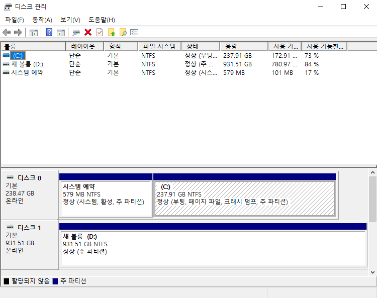
   
   2. 간단하게는 저장 공간을 강제로 칸막이를 만들어서 공간을 분리한다. (c,d,e 드라이브 등등)

2. 포매팅
   
   1. 정의: 파일 시스템을 설정하여 어떤 방식으로 파일을 저장하고 관리할 것인지를 결정하고, 새로운 데이터를 쓸 준비를 하는 작업을 의미.
   
   2. 예시
      
      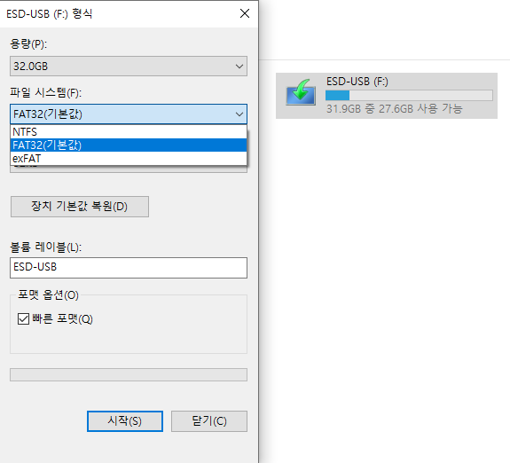
      
      NTFS(16TB), FAT32(4GB), exFAT(무제한)
   
   3. 주의사항
      
      1. 단순히 저장 장치를 완전히 삭제하는 것을 의미하지는 않음.
      
      2. 저수준 포매팅: 공장에서 실행하는 물리적 포매팅
      
      3. 논리적 포매팅: 파일 시스템을 생성하는 포매팅(교재에서 다루는 포매팅)

### 2. 파일 할당 방법

1. 블록(block)
   
   1. 정의: 하드 디스크의 가장 작은 저장 단위는 섹터이고 운영체제는 하나 이상의 섹터를 블록이라는 단위로 묶은 뒤 블록 단위로 파일과 디렉터리를 관리한다.
   
   2. 각 블록에는 위치를 식별하는 주소인 번호가 적혀있고, 작은 용량의 파일은 적은 수의 블록에 걸쳐 저장되고 큰 용량은 많은 수의 블록에 걸쳐 저장된다.
      
      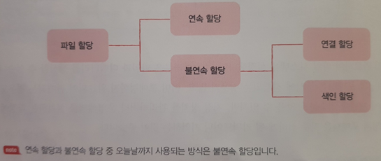

2. 연속 할당
   
   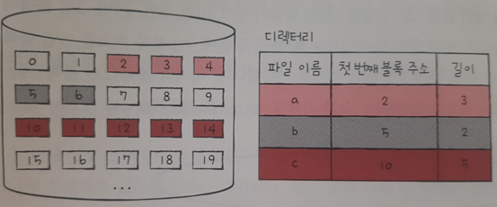
   
   1. 정의: 보조기억장치 내 연속적인 블록에 파일을 할당하는 방식
   
   2. 장점: 구현이 단순하다.
   
   3. 단점: **외부단편화**가 발생한다.
   
   4. 외부단편화 란? 위와 같은 상황에서 b파일을 삭제할 경우에 가운데 빈 블록은 총 7개 이지만, 길이가 2 혹은 5인 파일만 저장가능하다. 이를 외부단편화 라고 한다.
   
   5. 내부단편화 란? 100MB 메모리에 80MB 프로세스를 할당하면 20MB가 남지만 사용 불가능하다. 이를 내부단편화 라고 한다.

3. 연결 할당
   
   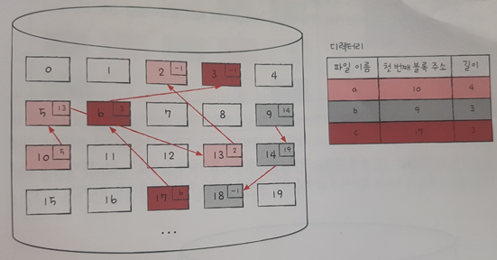
   
   1. 정의: 각 블록 일부에 다음 블록의 주소를 저장하여 각 블록이 다음 블록을 가리키는 형태로 할당.(연결 리스트 개념 참고)
   
   2. 장점: 외부단편화 문제 해결
   
   3. 단점
      
      1. 반드시 첫 번째 블록부터 하나씩 차례대로 읽어야 한다.
         
         1. 임의의 위치(파일이 위치한 블록)에 접근하는 속도가 매우 느리다.
      
      2. 하드웨어 고장이나 오류 발생 시 해당 블록 이후 블록은 접근할 수 없다.
   
   4. 단점들 때문에 조금 변형해서 사용하는데 대표적인 파일 시스템이 FAT 이다.

4. 색인 할당
   
   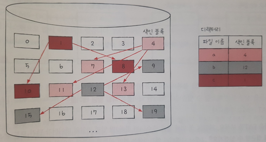
   
   1. 정의: 하나의 블록(색인 블록)에 파일의 모든 블록 주소를 모아서 관리하는 방식
   
   2. 장점
      
      1. 외부단편화 해결
      
      2. 디렉터리에 색인 블록을 저장하기 때문에 임의의 위치에 접근하기 쉽다.
   
   3. 단점
      
      1. 하나의 색인 블록에 저장 가능한 블록 주소의 한계가 존재.
      
      2. 용량이 적은 파일인 경우에도 색인 블록을 사용하기 때문에 저장 공간 손실.
   
   4. 이를 활용하여 만든 시스템중 대표는 유닉스 파일 시스템이다.

### 3. FAT 파일 시스템

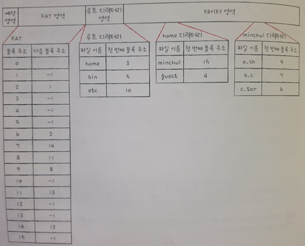

1. 정의: 서로 연결된 블록들의 관계를 하나의 테이블 형태로 만들어 모두 관리 한다. 이러한 테이블을 파일 할당 테이블(File Allocation Table)이라 한다.

2. 사용처: USB메모리, SD카드 등 저용량 저장 장치용 파일 시스템으로 사용

3. 추가정보: 윈도우에서는 '블록'이라는 용어 대신 '클러스터'를 사용한다. 또한 FAT파일 시스템은 디렉터리 엔트리에 파일 속성과 관련된 정보를 저장한다.

4. 접근 예시: /home/minchul/a.sh
   
   1. 루트 디렉터리 영력에서 home을 찾고 3번 주소를 읽는다.
   
   2. 3번 주소를 읽어서 home 디렉터리 내용을 살펴본다.
   
   3. minchul을 찾고 15번 주소를 읽는다.
   
   4. 15번 주소를 읽어서 minchul 디렉터리 내용을 살펴본다.
   
   5. a.sh를 찾고 9번 주소를 읽는다.
   
   6. 9번을 시작으로 8번, 11번, 13번블록에 접근한다.

### 4. 유닉스 파일 시스템

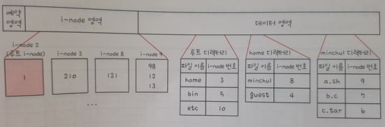

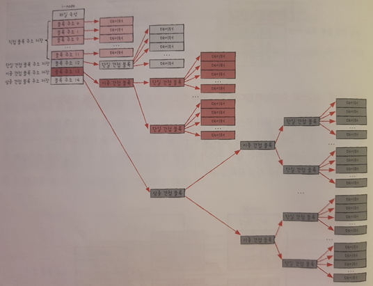

1. 정의: i-node를 활용하여 관리하는 파일 시스템

2. i-node
   
   1. 구성: 파일속성 + 15개의 블록주소
   
   2. 블록 주소를 포함하는 색인 블록이며, 각 i-node에는 번호가 부여되어있고 유한한 크기를 가진다.
   
   3. 규칙.
      
      1. 블록 주소 중 12개에는 직접 블록 주소를 저장한다.(0~11번을 직접 블록이라 한다.)
      
      2. 12개로 부족하다면, 열세 번째 블록 주소에 파일 데이터를 저장한 블록 주소를 모은 **단일 간접 블록**의 주소를 저장한다.(또다른 색인 블록의 주소를 저장)
      
      3. 2번 규칙으로도 부족하다면 열네 번째 블록 주소에 단일 간접 블록들의 주소를 저장하는 블록인 **이중 간접 블록**의 주소를 저장한다.
      
      4. 3번의 규칙으로도 부족하다면 열다섯 번째 블록 주소에 일중 간접 블록들의 주소를 저장하는 블록인 **삼중 간접 블록**의 주소를 저장한다.
   
   4. 접근예시: /home/minchul/a.sh
      
      1. 최초 루트 디렉터리의 위치를 i-node에서 찾아서 읽는다.(2번 i-node)
      
      2. 2번 i-node를 읽어서 1번 주소를 읽고 그 결과 루트 디렉터리 내부를 검색.
      
      3. home을 찾은뒤, 3번 i-node를 읽고 210번 주소를 읽어서 home 내부를 검색.
      
      4. minchul을 찾은뒤 8번 i-node를 읽고 121번 주소를 읽어서 내부를 검색.
      
      5. a.sh파일을 찾은뒤 9번 i-node를 읽고 98번, 12번, 13번 주소에 접근한다.

### 5. 추가정보

1. 저널링 파일 시스템
   
   1. 시스템 크래시: 파일 시스템을 변경하는 도중 컴퓨터가 강제로 종료되어 버린 상황
   
   2. 정의: 작업 로그를 통해 시스템 크래시가 발생했을 때 빠륵 복구하기 위한 방법
   
   3. 과정
      
      1. 작업 직전 파티션의 로그 영역에 수행하는 작업에 대한 로그를 남긴다.
      
      2. 로그를 남긴후 작업을 수행
      
      3. 작업이 끝나면 로그를 삭제

2. 마운트
   
   1. 정의: 한 저장 장치의 파일 시스템에서 다른 저장 장치의 파일 시스템에 접근할 수 있도록 파일 시스템을 편입 시키는 작업
   
   1번 이미지: A 컴퓨터 디렉터리 구조
   
   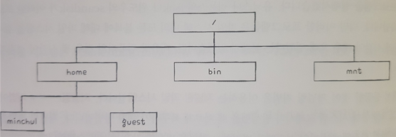
   
   2번 이미지: B USB 디렉터리 구조

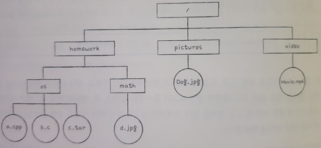

3번 이미지: A 컴퓨터 /mnt에 B USB를 마운트한 결과

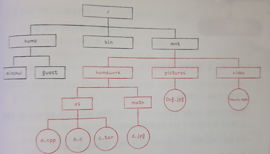