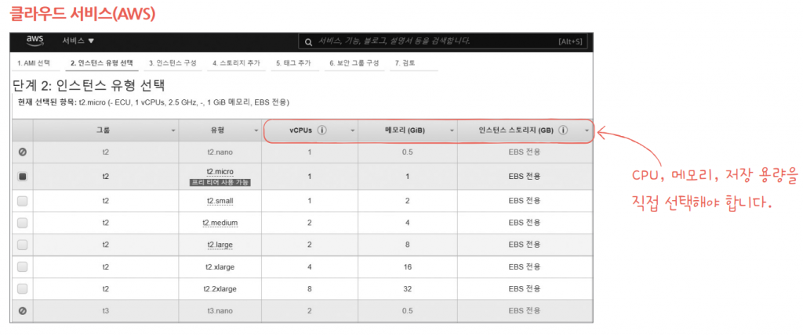

# 01-1. 컴퓨터 구조를 알아야 하는 이유

### 학습목표

- 개발자가 컴퓨터 구조를 알아야 하는 이유는 무엇일까?
- 좋은 개발자가 되기 위한 조건은 무엇일까?

### 1. 문제 해결 능력을 기를 수 있다.

- 알고리즘 문제를 풀 때도 코드 자체 문제 외의 메모리/시간 초과의 문제가 존재함.
- 단순히 **코드**를 컴퓨터에 **입력**하는 사람이 아니라, 컴퓨터를 **활용**할 수 있어야 함.
- ***미지의 대상*** ❌ ***분석의 대상*** ⭕
  
  

### 2. 개발시 성능/용량/비용을 주체적으로 고려할 수 있다.

- 알고리즘에서 메모리/시간이 중요하듯이 실제로 성능/용량도 개발의 주 요건임.
- **’해줘’** ❌ **‘가능합니다’** ⭕