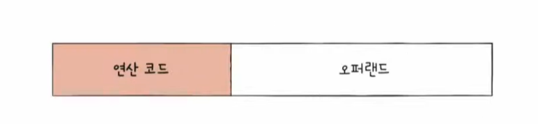
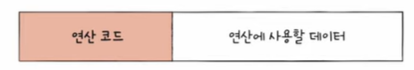
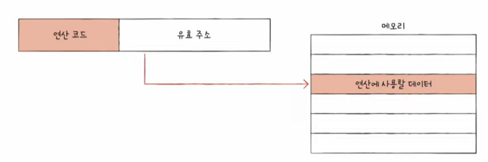
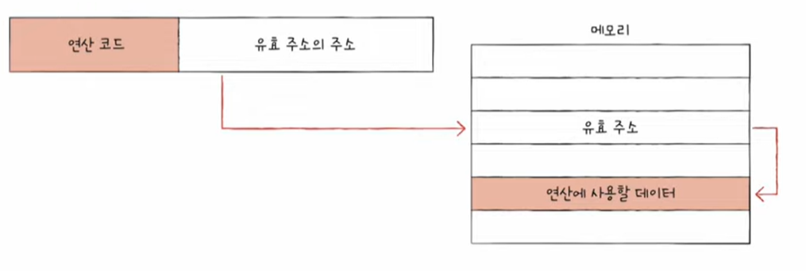
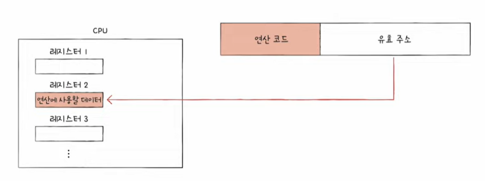
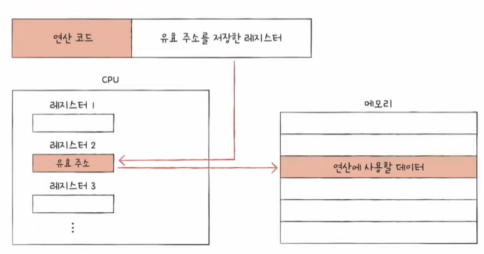
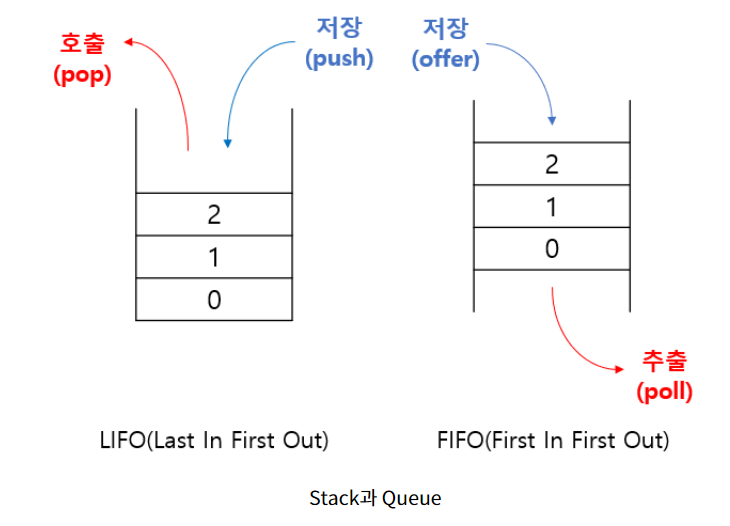

# Chapter 03-2 명령어의 구조
학습 목표 : 명령어의 구조와 주소 지정 방식을 학습하며 명령어의 생김새와 작동 원리를 이해한다.

## 연산 코드와 오퍼랜드

### 명령어 : 연산코드(연산자) + 오퍼랜드(피연산자)

- 분홍 부분 : 연산 코드 필드 , 흰 부분 : 오퍼랜드 필드

### 오퍼랜드
- '연산에 사용할 데이터' or '연산에 사용할 데이터가 저장된 위치'
- 오퍼랜드 필드의 경우 연산에 사용할 데이터를 직접 명시하기보다 데이터가 저장된 위치, 메모리 주소나 레지스터 이름을 담음 -> 따라서 **주소필드**라고도 함.

- 오퍼랜드의 종류
     오퍼랜드는 명령어의 개수만큼 이름을 붙인다.
     - 1-주소 명령어 : 명령어가 하나인 경우
     - 2-주소 명령어 : 명령어가 두개인 경우 

### 연산코드
- 명령어가 수행할 연산
- 연산코드의 유형
    1. 데이터 전송
        - MOVE
        - STORE
        - LOAD  : 메모리 -> CPU 로 데이터 가져오기
        - PUSH : 스택에 데이터 저장
        - POP : 최상단 데이터 가져오기
    2. 산술/논리 연산
        - ADD/SUBSTRACT/MULTIPLY,DIVIDE
        - INCREMENT/DECREMENT
        - AND/OR/NOT
        - COMPARE : 두 개의 숫자 또는 TRUE/FALSE 값 비교

    3. 제어 흐름 변경
        - JUMP : 특정 주소로 실행 순서 옮기기
        - CONDITIONAL JUMP : 조건에 부합할 때 특정 주소로 실행 순서 옮기기
        - HALT : 프로그램 실행 멈추기
        - CALL : 되돌아올 주소를 저장한 채 특정 주소로 실행 순서 옮기기
        - RETURN : CALL 호출할 때 저장했던 주소로 돌아가기

    4. 입출력 제어
        - READ : 특정 입출력 장치로부터 데이터 읽기
        - WRITE : 데이터 쓰기
        - START IO : 입출력 장치 시작
        - TEST IO : 입출력 장치 상태 확인

## 주소 지정 방식

- **유효주소** : 연산에 사용할 데이터가 저장된 위치
- **명령어 주소 지정 방식**
    - 연산에 사용할 데이터가 저장된 위치를 찾는 방법
    - 유효 주소를 찾는 방법

### 즉시 주소 지정 방식

    - 데이터를 오퍼랜드 필드에 직접 명시하는 방법
    - 가장 간단한 형태의 주소 지정 방식
    - 장점 : 연산에 사용할 데이터를 따로 찾는 과정이 없기에 빠름.
    - 단점 : 표현할 수 있는 크기가 작아짐

### 직접 주소 지정 방식

    - 유효주소를 오퍼랜드 필드에 직접 명시하는 방법
    - 즉시주소지정방식보다 데이터 저장의 크기가 큼
    - 단, 오퍼랜드 필드 길이는 연산코드 길이만큼 짧아짐
    - 표현할 수 있는 유효 주소에 제한이 있음

### 간접 주소 지정 방식

    - 유효주소의 주소를 오퍼랜드 필드에 명시
    - 유효주소의 주소를 명시하므로 표현할 수 있는 유효주소의 범위가 넓어짐
    - 단, 유효주소의 주소 -> 유효주소로 메모리 접근이 필요하기에 즉시,직접주소지정방식보다 느림

### 레지스터 주소 지정 방식

    - 레지스터를 오퍼랜드 필드에 직접 명시하는 방법
    - CPU가 메모리에 접근하는 속도보다 레지스터에 접근하는 속도가 훨씬 빠르다. (레지스터 : CPU 안에 있음, 메모리 : CPU 밖에 있음)
    - 단, 레지스터를 직접 명시하기에 레지스터 크기에 제한이 생길 수 있음.

### 레지스터 간접 주소 지정 방식

    - 연산에 사용할 데이터를 메모리에 저장, 그 주소를 저장한 레지스터를 오퍼랜드 필드에 명시
    - 메모리에 접근하는 횟수가 1번이므로 간접주소지정방식보다 빠르다.

#### 좀 더 알아보기!

- **스택**
    - 한쪽 끝이 막혀 있는 통과 같은 저장 공간
    - '나중에 저장한 데이터를 가장 먼저 빼내는 데이터 관리 방식(후입선출)'
    - LIFO (Last In First Out)
    - 네이버 검색창을 보면 나중에 입력한 데이터가 가장 위에 있음

- 용어 정의
    - PUSH : 스택에 새로운 데이터를 저장하는 명령어
    - POP : 스택에 저장된 데이터를 꺼내는 명령어

- **큐**
    - 양쪽이 뚫려 있는 통과 같은 저장 공간
    - '가장 먼저 저장된 데이터부터 빼내는 데이터 관리 방식'
    - FIFO(First In First Out)
    - 놀이기구 기다리는 줄, 음식점 대기 순서 등

