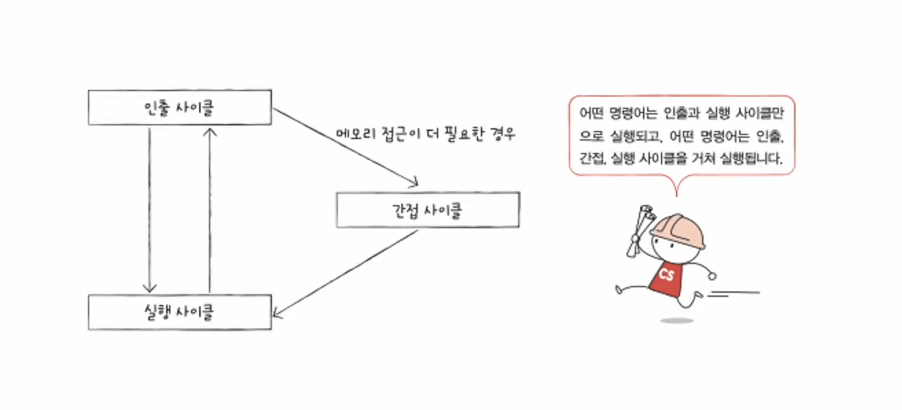
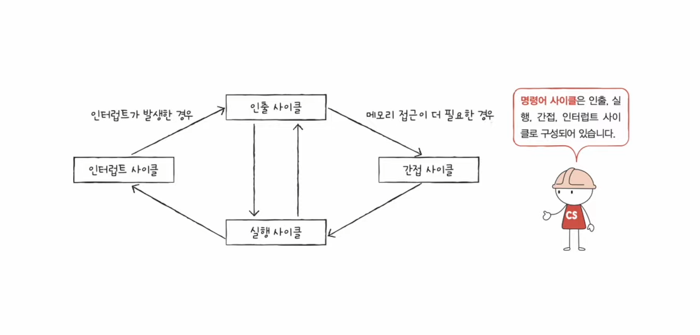

# 04-3 명령어 사이클과 인터럽트

## 명령어 사이클

프로그램 속에서 실행되는 명령어들의 일정한 주기

##### 인출 사이클 + 실행 사이클 ( + 간접 사이클)

인출 사이클 - 메모리에서 CPU로 가져오는 과정

실행 사이클 - CPU 내에서 명령이 실행되는 과정

간접 사이클 - 실행 이전에 추가적인 메모리 접근이 필요하여 추가되는 과정

## 인터럽트

CPU의 정상적인 작업을 방해하는 신호

#### 동기 인터럽트 (예외)

- 프로그래밍 상의 오류와 같은 예외적인 상황의 경우 발생

#### 비동기 인터럽트 (하드웨어 인터럽트)

- 주로 입출력 장치에 의해 발생하며 입력을 처리하기 위해 발생

- 효율적인 명령어 처리를 위해 발생하기도 함

---

하드웨어 인터럽트 처리 순서

1. 입출력 장치에서 CPU로 <u>인터럽트 요청 신호</u>를 보냄

2. CPU는 실행 사이클이 끝나고 명령어를 인출하기 전에 항상 인터럽트 여부를 확인함

3. CPU가 인터럽트 요청을 확인하고 <u>인터럽트 플래그</u>를 통해 현재 수용 가능한 인터럽트인지 확인함

4. 수용 가능한 인터럽트라면 CPU는 현재까지의 작업을 백업함 `in 스택영역`

5. CPU는 <u>인터럽트 벡터</u>를 참조하여 <u>인터럽트 서비스 루틴</u>을 실행함

6. 인터럽트 서비스 루틴 실행이 끝나면 4번에서 백업해둔 작업을 복구하여 실행을 재개함

---

인터럽트 요청 신호 - 입출력 장치에서 CPU를 향해 인터럽트를 위해 사전에 보내는 신호

인터럽트 플래그 - 인터럽트를 수용할지 무시할지 결정하는 플래그

- 현재 중요한 작업을 처리 중이면 인터럽트 플래그에 의해 무시됨

- 그러나 무시할 수 없는 인터럽트도 존재 (ex. 하드웨어 고장, 정전)

인터럽트 서비스 루틴 (인터럽트 핸들러) - 인터럽트를 처리하기 위한 프로그램

- 입출력 장치마다 다른 서비스 루틴을 가짐

인터럽트 벡터 - 각기 다른 서비스 루틴을 식별하기 위한 정보

- 인터럽트 서비스 루틴의 시작 주소를 포함함

### 예외의 종류

- 폴트(fault) - 예외를 처리하고 예외가 발생한 명령어부터 실행을 재개

- 트랩(trap) - 예외를 처리하고 예외가 발생한 명령어의 다음 명령어부터 실행을 재개
  
  - 주로 디버깅에 사용

- 중단(abort) - CPU가 실행 중인 프로그램을 강제 중단 시킬 수 밖에 없는 심각한 오류인 경우

- 소프트웨어 인터럽트 - 시스템 호출 시 발생 `in 9장`
