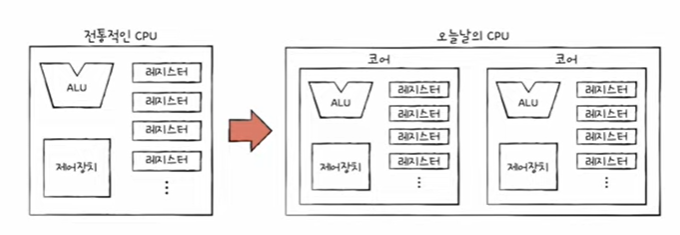

# chapter_05

### 05-1. 빠른 CPU를 위한 설계 기법

##### 학습목표

1. 클럭, 멀티코어, 멀티스레드는 무엇인가?

2. CPU 속도와의 관계

##### 1.  클럭

- 정의: CPU의 속도를 나타내는 단위(Hz)

- 특이사항
  
  - 일을 시키는 명령을 보내는 시간
  
  - 클럭의 속도는 일정하지 않다. 강제로 최대 속도를 끌어 올리는것을 '오버클럭킹'이라 한다.
  
  - 단점: 클럭의 속도가 높을 수록, CPU 속도가 오르지만 발열과 소비전력이 커진다.
  
  - 해결책: 멀티코어, 멀티스레드

##### 2. 멀티코어

- 코어란?     명령어를 실행하는 부품

- 특이사항
  
  - 근로자의 수
  
  - 코어가 많으면 많을 수록 CPU의 속도는 빨라진다. 그러나, 완전히 비례하여 속도가 증가하진 않는다.
  
  - 이 전에는 CPU가 명령어를 실행하는 부품이였다면, 오늘날에는 CPU는 명령어를 실행하는 부품을 여러개 포함하는 부품

##### 3. 멀티스레드

- 스레드란?     명령어를 실행하는 단위

- 하드웨어 스레드: 하나의 코어가 동시에 처리하는 명령어 단위. (= 논리프로세서)
  
  즉, 2코어 4스레드는 CPU가 2개의 코어를 가지고 있고 한번에 4개의 명령어 처리가 가능하다는 뜻이다.

- 소프트웨어 스레드: 하나의 프로그램에서 독립적으로 실행되는 단위
  
  (추후 10장에서 자세히 다룰것.)

- 레지스터: 명령어 처리를 위한 임시 저장 장치

- 특이사항
  
  - 동시에 명령을 실행
  
  - 명령어를 실행하는 레지스터들의 묶음인 레지스터 세트의 수를 스레드의 개수로 봐도 무방

##### 4. 결론

CPU의 속도 향상을 위해서,

- 클럭은 빨라야 하고, 코어는 많아야 하고, 스레드는 많아야 한다.
