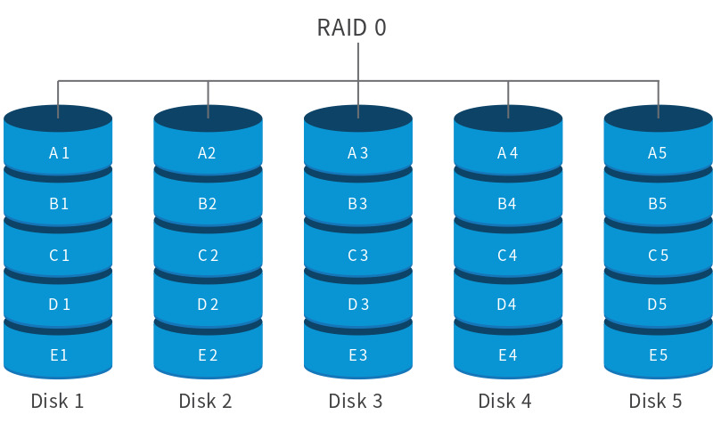
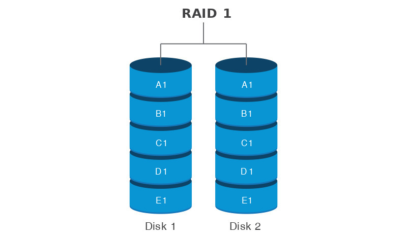
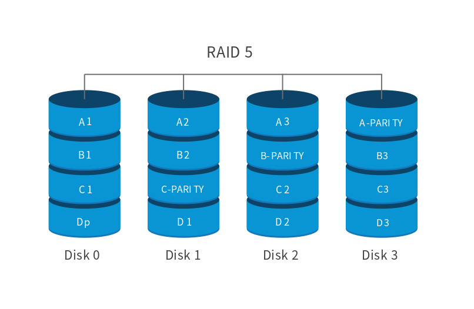
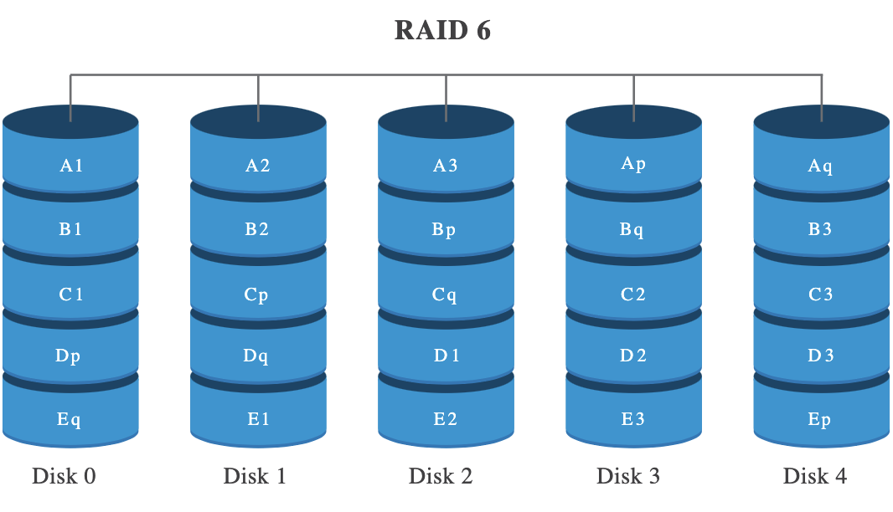

# Chapter07_2 RAID의 정의와 종류
학습목표 : RAID의 의미와 다양한 RAID에 대해 알아보기

## RAID(Redundant Array of Independent Disks)
- 데이터의 안전성 혹은 높은 성능을 위해 여러 개의 물리적 보조기억장치를 하나의 논리적 보조기억장치처럼 사용하는 기술
- 주로 하드디스크와 SSD를 사용
- RAID를 구성하는 방법을 RAID레벨이라고 함

### RAID 레벨(= RAID 구성 방법)
- 가장 대표적인 RAID레벨
- RAID 0
  - 보조기억장치에 데이터를 단순히 나누어 저장하는 구성 방식
  - 속도는 빠르나 저장된 정보가 안전하지 않음
      
- RAID 1 
  - 복사본을 만드는 방식
  - 완전한 복사본을 만드는 구성이기에 미러링이라고도 함.
  - 데이터를 원본, 복사본 두 군데에 쓰기에 속도 RAID 0 보다 느림
  - 복사본이 있어 데이터 복구는 쉬우나 용량이 적음
      
- RAID 4
  - RAID 1 처럼 완전한 복사본을 만드는 대신 패리티 비트를 저장한 장치를 두는 구성 방식
    - 패리티 비트 : 오류를 검출하고 복구하기 위한 정보
  - 패리티 비트를 통해 오류를 검출하고 오류가 있다면 복구시킴.
  - RAID1 보다 적은 하드디스크로 데이터를 안전하게 보관 가능
  - 단, 데이터를 나누어 저장해도 결국 패리티 디스크에 모두 저장되기 때문에 병목현상 발생 가능

- RAID 5
  - 패리티 디스크를 하드디스크마다 분산하여 저장
  

- RAID 6
  - 하드디스크마다 두 개의 패리티를 둠
  - 새로운 정보를 저장할 때마다 두 개의 패리티에 저장하므로 쓰기 속도는 RAID 5 보다 느림
  - 데이터가 상대적으로 더 안정적
  

