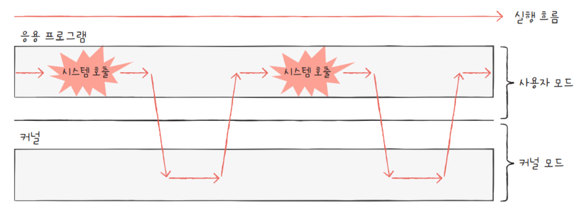

# chapter_09

### 09-2. 운영체제의 큰 그림

##### 학습목표

1. 커널이란?

2. 시스템 호출과 이중 모드란?

3. 운영체제가 제공하는 핵심 서비스의 종류

##### 1. 커널

1. 정의: 운영체제의 핵심 서비스를 담당하는 부분.
   
   - 추가설명: 앞에서 운영체제가 메모리에 적재되어있는 영역을 **커널**이라고 설명했다. 그러나, 정확히는 운영체제의 여러 기능중 핵심 서비스를 담당하는 부분이 적재되어 있는 영역을 **커널**이라 한다.
   - 추가설명2:  이후, 교재의 운영체제를 지칭할때 별도의 언급이 없다면 커널을 뜻한다.
     
     

2. 핵심 서비스
   
   1. 자원에 접근하고 조작하는 기능
   
   2. 프로그램이 올바르고 안전하게 실행되게 하는 기능

3. 사용자 인터페이스(대표적인 비핵심 서비스)
   
   1. 종류: 그래픽 유저 인터페이스(GUI), 커맨드 라인 인터페이스(CLI) 
   
   2. 운영 체제가 제공하는 서비스 이지만, 컴퓨터와 상호작용을 위한 통로일 뿐이지 커널에 속한 기능이 아니다.

##### 2. 이중 모드와 시스템 호출

1. 배경
   
   - 운영체제는 자원의 효율적인 관리를 위해서 응용 프로그램에 알맞는 자원을 배분 한다.
   - 운영체제는 실수를 막기위해서 응용 프로그램이 직접적으로 자원에 접근하는 것을 막는다. -> 문지기 역할

2. 이중모드
   
   1. 정의: CPU가 명령어를 실행하는 모드를 **커널 모드**와 **사용자 모드**로 구분하는 것.
   
   2. 배경2에서 설명하듯이, 운영체제에 의해 응용 프로그램은 기본적으로 **사용자 모드**로 실행된다. 그러나 자원에 접근할 필요가 있을 경우에는 **커널 모드**로 실행하여 커널 영역의 코드를 사용하고 자원에 접근한다.

3. 시스템 호출(system call)
   
   1. 정의: 응용 프로그램을 사용자 모드에서 커널 모드로 전환하는 방법.
   
   2. 작동 과정
      
      
      
      - 응용 프로그램 실행 -> 하드디스크에 데이터 저장 요구 -> 시스템 호출 -> 커널 영역에서 하드디스크에 데이터 저장하는 코드 실행 -> 데이터 저장 완료 -> 사용자 모드 복귀

##### 3. 운영체제의 핵심 서비스

1. 프로세스 관리
   
   1. 프로세스란? 자원을 할당받아 실행 중인 프로그램
   
   2. CPU는 한 번에 하나의 프로세스만 실행하기 때문에 어떻게 다양한 프로세스를 관리할 것인지, 동시에 실행되는 프로세스 환경, 문제점들은 이후 뒷부분(10장, 12장,13장)에서 자세히 다룰 예정입니다.

2. 자원 접근 및 할당
   
   1. 프로세스는 자원을 할당받아 실행한다. 특히, 대표적인 자원으로 CPU, 메모리, 입출력장치로 나누어 본다.
   
   2. CPU
      
      - CPU는 한번에 하나의 프로세스만 실행한다. 그렇기 때문에 어떤 프로세스가 얼만큼 CPU를 독점하고 있을 것인가? 를 결정해야한다. 이를 **CPU 스케줄링**이라고 하며 11장에서 알아봅시다.
   
   3. 메모리
      
      - 프로세스가 다양한 만큼 크기도, 적재되는 주소도 다양하다. 그래서 프로세스가 실행할때 적재공간이 부족하거나 공간이 있음에도 적재할 수 없는 상황이 발생하는데 이를 어떻게 해결할지는 14장에서 알아봅시다.
   
   4. 입출력장치
      
      - 입출력장치가 발생하는 인터럽트는 커널 영역에 속한 인터럽트 서비스 루틴을 통해서 해결한다.

3. 파일 시스템 관리
   
   1. 파일 시스템이란? 
      
      - 파일을 열고, 생성하고, 삭제하는 기능과 폴더로 관리하는 기능
   
   2. 운영체제가 보조기억장치 속 데이터를 어떻게 파일과 디렉토리(폴더)로 관리하는지는 15장에서 알아봅시다.

##### 별첨

1. 이중 모드가 아닌 삼중 모드인 운영체제도 있다.
   
   - 가상 머신을 제공하는 운영체제는 가상 머신 속 운영체제에서 커널모드로 전환하는게 복잡하기 때문에  가상 머신을 위한 모드인 **하이퍼바이저 모드**가 존재한다.

2. 시스템 호출의 종류
   
   - 관심있다면 280p한번 참고해주세요.
